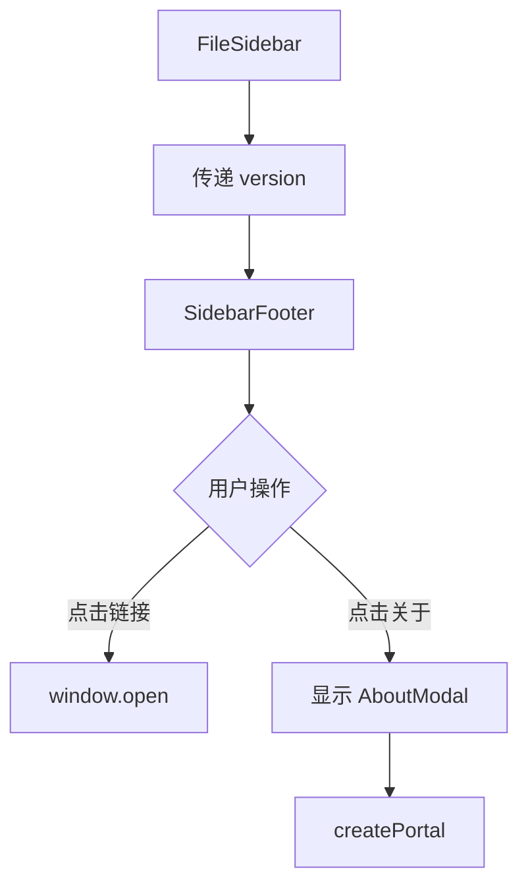

# 侧边栏底部信息 技术设计

## 📋 元信息

| 项目 | 内容 |
|------|------|
| **文档编号** | TD-002 |
| **关联 PRD** | FEAT-002 |
| **编写日期** | 2024-01-13 |
| **负责人** | @your-name |
| **当前状态** | 📝 草稿 |

---

## 🎯 方案概述

### 需求回顾
- 在文件侧边栏底部添加固定信息区域
- 显示版本号、Slogan、快捷链接
- 支持关于弹窗

### 设计目标
- 最小化代码改动
- 复用现有组件和样式
- 版本号自动从 package.json 读取

---

## 🏗️ 架构设计

### 整体架构

```
┌─────────────────────────────────────┐
│         FileSidebar 组件             │
│  ┌───────────────────────────────┐  │
│  │  Header (工作区 + 新建)        │  │
│  ├───────────────────────────────┤  │
│  │  Search (搜索框)               │  │
│  ├───────────────────────────────┤  │
│  │  FileList (文件列表，可滚动)   │  │
│  ├───────────────────────────────┤  │
│  │  SidebarFooter (底部信息) ★新增 │  │
│  └───────────────────────────────┘  │
└─────────────────────────────────────┘
           │
           │ 点击关于
           ▼
┌─────────────────────────────────────┐
│         AboutModal (关于弹窗) ★新增   │
└─────────────────────────────────────┘
```

### 组件划分

| 组件 | 类型 | 文件位置 |
|------|------|----------|
| FileSidebar | 修改 | `components/Sidebar/FileSidebar.tsx` |
| SidebarFooter | 新增 | `components/Sidebar/SidebarFooter/` |
| AboutModal | 新增 | `components/Sidebar/SidebarFooter/AboutModal.tsx` |

---

## 📦 技术选型

### 新增依赖
无需新增依赖

### 复用现有
- `lucide-react` - 图标
- `react-hot-toast` - 链接复制提示（可选）

---

## 🔄 数据流设计

### 版本号获取

```typescript
// 从 package.json 读取版本号
// 方案1：构建时注入（推荐）
// 在 vite.config.ts 中定义
define: {
  APP_VERSION: JSON.stringify(process.env.npm_package_version)
}

// 方案2：运行时读取（备选）
// 使用 import.meta.url 或动态导入
```

### 组件通信



---

## 🎨 组件设计

### 文件结构

```
components/Sidebar/
├── FileSidebar.tsx          # 修改：添加底部组件
├── FileSidebar.css          # 修改：添加样式
└── SidebarFooter/           # 新增目录
    ├── index.tsx
    ├── SidebarFooter.tsx    # 底部信息组件
    ├── AboutModal.tsx       # 关于弹窗组件
    └── styles.css
```

### SidebarFooter 组件

```typescript
// components/Sidebar/SidebarFooter/SidebarFooter.tsx

interface SidebarFooterProps {
  version: string;
}

export function SidebarFooter({ version }: SidebarFooterProps) {
  const [showAbout, setShowAbout] = useState(false);

  const links = {
    website: 'https://weimd.gudong.site/',
    github: 'https://github.com/tenngoxars/WeMD',
  };

  return (
    <>
      <footer className="fs-footer">
        <div className="fs-footer-brand">
          <Smartphone size={16} />
          <span className="fs-footer-name">WeMD</span>
        </div>
        <div className="fs-footer-version">v{version}</div>
        <div className="fs-footer-slogan">
          Markdown 写作，一键到公众号
        </div>
        <div className="fs-footer-links">
          <a
            href={links.website}
            target="_blank"
            rel="noopener noreferrer"
            className="fs-footer-link"
          >
            <Globe size={14} /> 官网
          </a>
          <a
            href={links.github}
            target="_blank"
            rel="noopener noreferrer"
            className="fs-footer-link"
          >
            <Github size={14} /> GitHub
          </a>
          <button
            onClick={() => setShowAbout(true)}
            className="fs-footer-link"
          >
            <Info size={14} /> 关于
          </button>
        </div>
      </footer>

      {showAbout && (
        <AboutModal
          isOpen={showAbout}
          onClose={() => setShowAbout(false)}
          version={version}
        />
      )}
    </>
  );
}
```

### AboutModal 组件

```typescript
// components/Sidebar/SidebarFooter/AboutModal.tsx

interface AboutModalProps {
  isOpen: boolean;
  onClose: () => void;
  version: string;
}

export function AboutModal({ isOpen, onClose, version }: AboutModalProps) {
  if (!isOpen) return null;

  return createPortal(
    <div className="modal-overlay" onClick={onClose}>
      <div className="about-modal" onClick={(e) => e.stopPropagation()}>
        <button className="modal-close" onClick={onClose}>
          <X size={18} />
        </button>

        <div className="about-logo">
          
        </div>

        <h2 className="about-title">WeMD</h2>
        <p className="about-version">v{version}</p>

        <p className="about-slogan">
          Markdown 写作，一键到公众号
        </p>

        <div className="about-description">
          <p>
            WeMD 是专为微信公众号设计的 Markdown 编辑器，
            本地优先，让创作更自由。
          </p>
        </div>

        <div className="about-links">
          <a href="https://weimd.gudong.site/" target="_blank" rel="noopener noreferrer">
            <Globe size={16} /> 官网
          </a>
          <a href="https://github.com/tenngoxars/WeMD" target="_blank" rel="noopener noreferrer">
            <Github size={16} /> GitHub
          </a>
          <a href="https://weimd.gudong.site/docs" target="_blank" rel="noopener noreferrer">
            <BookOpen size={16} /> 文档
          </a>
        </div>
      </div>
    </div>,
    document.body
  );
}
```

### FileSidebar 修改

```typescript
// components/Sidebar/FileSidebar.tsx

// 添加导入
import { SidebarFooter } from './SidebarFooter';

// 在返回的 JSX 中，</aside> 前添加
return (
  <aside className="file-sidebar">
    {/* ... 现有内容 ... */}

    {/* 新增底部信息 */}
    <SidebarFooter version={APP_VERSION} />
  </aside>
);
```

---

## ⚙️ 配置变更

### Vite 配置修改

```typescript
// apps/web/vite.config.ts

export default defineConfig({
  // ... 现有配置
  define: {
    // 从 package.json 读取版本号
    APP_VERSION: JSON.stringify(process.env.npm_package_version),
  },
});
```

### 类型声明

```typescript
// apps/web/src/vite-env.d.ts

interface ImportMetaEnv {
  readonly APP_VERSION: string;
}

interface ImportMeta {
  readonly env: ImportMetaEnv;
}
```

---

## 🧪 测试策略

### 单元测试
- [ ] SidebarFooter 渲染正确
- [ ] 版本号正确显示
- [ ] 链接 href 正确

### 集成测试
- [ ] 点击关于弹窗打开/关闭
- [ ] 点击链接在新标签页打开

### 视觉测试
- [ ] 亮色模式样式正确
- [ ] 深色模式样式正确
- [ ] 响应式布局正确

---

## 🚀 实施计划

| 任务 | 负责人 | 预计工时 |
|------|--------|----------|
| 1. 修改 Vite 配置注入版本号 | @name | 0.5h |
| 2. 创建 SidebarFooter 组件 | @name | 1h |
| 3. 创建 AboutModal 组件 | @name | 1h |
| 4. 修改 FileSidebar 集成 | @name | 0.5h |
| 5. 编写 CSS 样式 | @name | 1h |
| 6. 测试与调优 | @name | 0.5h |

**总计**: 约 4.5 小时

---

## ⚠️ 风险与应对

| 风险 | 影响 | 应对措施 |
|------|------|----------|
| package.json 版本号读取失败 | 版本显示为 undefined | 添加默认值 '1.0.0' |
| 深色模式样式适配问题 | 深色模式下显示异常 | 使用 CSS 变量确保兼容 |
| 弹窗层级被遮挡 | 弹窗无法显示 | 使用 createPortal 到 body |

---

## 📚 参考资料

- [PRD 文档](./prd.md)
- [UI 设计](./ui-design.md)
- [现有侧边栏组件](../../../../../apps/web/src/components/Sidebar/FileSidebar.tsx)
- [Vite 环境变量](https://vitejs.dev/guide/env-and-mode.html)

---

## 📝 变更记录

| 日期 | 版本 | 变更内容 | 作者 |
|------|------|----------|------|
| 2024-01-13 | 1.0 | 初始版本 | @Claude |
