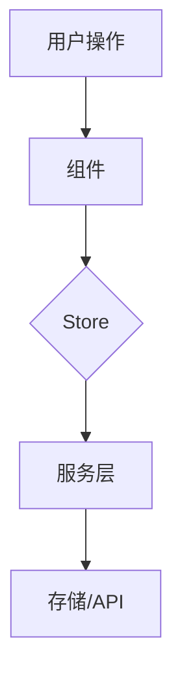

# [功能名称] 技术设计

> **角色提示**：编写本文档时，请扮演 **技术工程师** 角色
> 详细角色说明请查看：[docs/templates/roles/03-engineer.md](../docs/templates/roles/03-engineer.md)

---

## 📋 元信息

| 项目 | 内容 |
|------|------|
| **文档编号** | TD-XXX |
| **关联 PRD** | FEAT-XXX |
| **编写日期** | YYYY-MM-DD |
| **负责人** | @your-name |
| **审核人** | @reviewer |
| **当前状态** | 📝 草稿 / 🤔 待评审 / ✅ 已通过 |

---

## 🎯 方案概述

### 需求回顾
- 简述功能需求

### 设计目标
- 性能目标
- 可维护性目标
- 扩展性目标

---

## 🏗️ 架构设计

### 整体架构
```
┌─────────────────────────────────┐
│                                 │
│      [放置架构图]               │
│                                 │
└─────────────────────────────────┘
```

### 模块划分
| 模块 | 职责 | 文件位置 |
|------|------|----------|
| xxx | xxx | xxx |

---

## 📦 技术选型

### 新增依赖
| 包名 | 版本 | 用途 |
|------|------|------|
| xxx | ^x.x.x | xxx |

### 复用现有
- 使用现有组件：xxx
- 使用现有工具：xxx

---

## 🔄 数据流设计



### Store 变更
- **修改的 Store**：`editorStore` / `themeStore` / `uiStore`
- **新增 State**：
  ```typescript
  interface XxxStore {
    newField: string;
  }
  ```

---

## 🎨 组件设计

### 组件树
```
FeatureComponent/
├── index.tsx           # 主组件
├── Component.tsx       # 子组件
├── hooks/
│   └── useFeature.ts   # 自定义 Hook
└── styles.css          # 样式
```

### 组件接口
```typescript
interface FeatureProps {
  // 组件 props 定义
}
```

---

## 💾 存储设计

### IndexedDB
- **ObjectStore**: xxx
- **Index**: xxx

### LocalStorage
- **Key**: `wemd.xxx`
- **Value**: xxx

---

## 🔌 API 设计

### 新增接口 (如涉及后端)
```typescript
// 接口定义
interface XxxAPI {
  // ...
}
```

### 调用示例
```typescript
const result = await api.xxx();
```

---

## 🧪 测试策略

### 单元测试
- [ ] 核心逻辑函数
- [ ] 自定义 Hook
- [ ] 工具函数

### 集成测试
- [ ] 组件交互
- [ ] Store 状态变更
- [ ] 存储/API 调用

### E2E 测试
- [ ] 完整用户流程

---

## 🚀 实施计划

### 开发任务
| 任务 | 负责人 | 预计工时 |
|------|--------|----------|
| xxx | @name | xh |

### 依赖关系
```
任务A --> 任务B --> 任务C
```

---

## ⚠️ 风险与应对

| 风险 | 影响 | 应对措施 |
|------|------|----------|
| xxx | xxx | xxx |

---

## 📚 参考资料

- [PRD 文档](./prd.md)
- [UI 设计](./ui-design.md)
- [相关 Issue](#)

---

## 📝 变更记录

| 日期 | 版本 | 变更内容 | 作者 |
|------|------|----------|------|
| YYYY-MM-DD | 1.0 | 初始版本 | @name |
