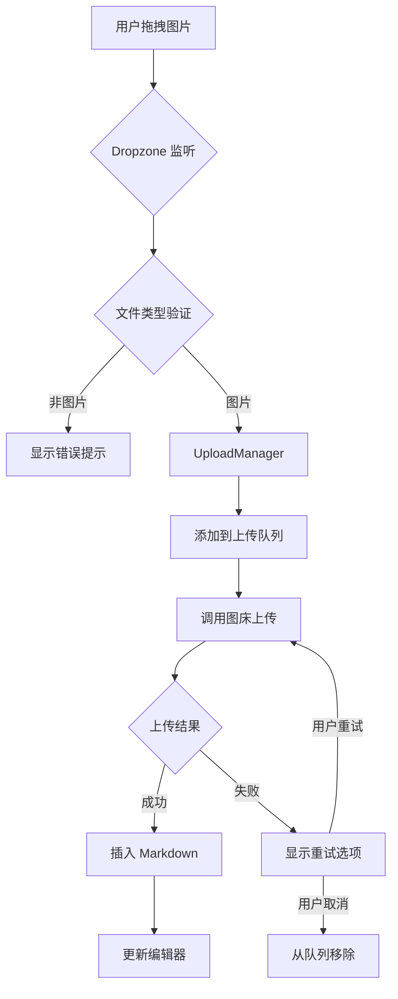

# 图片拖拽上传 技术设计

## 📋 元信息

| 项目 | 内容 |
|------|------|
| **文档编号** | TD-001 |
| **关联 PRD** | FEAT-001 |
| **编写日期** | 2024-01-13 |
| **负责人** | @your-name |
| **当前状态** | 📝 草稿 |

---

## 🎯 方案概述

### 需求回顾
- 支持拖拽图片文件到编辑器自动上传
- 支持粘贴截图直接上传
- 支持批量上传
- 上传进度展示
- 错误处理与重试

### 设计目标
- 无侵入式集成到现有编辑器
- 复用现有图床服务
- 保持编辑器性能不受影响

---

## 🏗️ 架构设计

### 整体架构

```
┌─────────────────────────────────────────────────────────┐
│                    用户操作层                           │
│  拖拽文件 / 粘贴剪贴板                                   │
└──────────────────────┬──────────────────────────────────┘
                       │
┌──────────────────────▼──────────────────────────────────┐
│                  Dropzone 组件                           │
│  - dragover/drop 事件监听                               │
│  - paste 事件监听                                        │
│  - 文件类型验证                                          │
└──────────────────────┬──────────────────────────────────┘
                       │
┌──────────────────────▼──────────────────────────────────┐
│              ImageUploadService (新建)                   │
│  - 队列管理                                              │
│  - 进度追踪                                              │
│  - 错误处理                                              │
└──────────────────────┬──────────────────────────────────┘
                       │
┌──────────────────────▼──────────────────────────────────┐
│           现有图床服务                                   │
│  - ImageUploadService (本地)                            │
│  - R2WorkerService (Cloudflare R2)                      │
│  - QiniuService (七牛云)                                 │
└──────────────────────┬──────────────────────────────────┘
                       │
┌──────────────────────▼──────────────────────────────────┐
│              编辑器插入                                  │
│  - 插入 Markdown 图片语法                                │
│  - 更新预览                                              │
└─────────────────────────────────────────────────────────┘
```

### 模块划分

| 模块 | 职责 | 文件位置 |
|------|------|----------|
| Dropzone | 拖拽区域组件，处理 drag/drop/paste 事件 | `components/Editor/Dropzone/` |
| UploadManager | 上传队列和进度管理 | `components/Editor/UploadManager/` |
| imageUploadStore | 上传状态管理 | `store/imageUploadStore.ts` |
| useImageUpload | 上传逻辑 Hook | `hooks/useImageUpload.ts` |

---

## 📦 技术选型

### 新增依赖
无需新增依赖，使用现有技术栈。

### 复用现有
- **lucide-react**: 图标
- **react-hot-toast**: 上传成功/失败提示
- **zustand**: 状态管理
- **现有图床服务**: `apps/web/src/services/imageUpload/`

---

## 🔄 数据流设计



### Store 变更

**新建 Store**: `imageUploadStore.ts`

```typescript
interface UploadTask {
  id: string;
  file: File;
  progress: number;
  status: 'pending' | 'uploading' | 'success' | 'error';
  url?: string;
  error?: string;
}

interface ImageUploadStore {
  // 状态
  tasks: UploadTask[];
  isDragging: boolean;

  // 操作
  addTask: (file: File) => string;
  updateTask: (id: string, updates: Partial<UploadTask>) => void;
  removeTask: (id: string) => void;
  setDragging: (isDragging: boolean) => void;

  // 业务方法
  uploadFiles: (files: File[]) => Promise<string[]>;
  uploadSingle: (file: File) => Promise<string>;
  retryTask: (id: string) => Promise<void>;
}
```

---

## 🎨 组件设计

### 组件树

```
components/Editor/
├── Dropzone/
│   ├── index.tsx           # 导出
│   ├── Dropzone.tsx        # 拖拽区域组件
│   ├── DropOverlay.tsx     # 拖拽时的遮罩层
│   └── styles.css
├── UploadManager/
│   ├── index.tsx
│   ├── UploadManager.tsx   # 上传管理器
│   ├── ProgressBar.tsx     # 进度条
│   └── styles.css
└── hooks/
    └── useImageUpload.ts   # 上传逻辑 Hook
```

### Dropzone 组件接口

```typescript
interface DropzoneProps {
  onUploadSuccess: (url: string, file: File) => void;
  onUploadError?: (error: Error, file: File) => void;
  disabled?: boolean;
  children: React.ReactNode;  // 编辑器组件
}

// 使用示例
<Dropzone onUploadSuccess={(url) => insertImage(url)}>
  <MarkdownEditor />
</Dropzone>
```

### UploadManager 组件接口

```typescript
interface UploadManagerProps {
  tasks: UploadTask[];
  onRetry: (id: string) => void;
  onCancel: (id: string) => void;
}
```

---

## 💾 存储设计

无需新增存储，上传任务仅存在于内存状态中。

---

## 🔌 API 设计

### useImageUpload Hook

```typescript
interface UseImageUploadOptions {
  onProgress?: (file: File, progress: number) => void;
  onSuccess?: (url: string, file: File) => void;
  onError?: (error: Error, file: File) => void;
}

interface UseImageUploadReturn {
  upload: (file: File) => Promise<string>;
  uploadMultiple: (files: File[]) => Promise<string[]>;
  isUploading: boolean;
  progress: Record<string, number>;
}

export function useImageUpload(
  options?: UseImageUploadOptions
): UseImageUploadReturn;
```

### 现有图床服务适配

创建统一的上传接口适配器：

```typescript
// services/imageUpload/adapter.ts
interface ImageUploadAdapter {
  upload(file: File, onProgress?: (progress: number) => void): Promise<string>;
}

// 适配现有图床服务
class LocalStorageAdapter implements ImageUploadAdapter { /* ... */ }
class R2WorkerAdapter implements ImageUploadAdapter { /* ... */ }
class QiniuAdapter implements ImageUploadAdapter { /* ... */ }
```

---

## 🧪 测试策略

### 单元测试
- [ ] 文件类型验证函数
- [ ] 文件大小验证函数
- [ ] UploadTask 状态转换逻辑

### 集成测试
- [ ] 拖拽事件处理
- [ ] 粘贴事件处理
- [ ] 上传队列管理
- [ ] 进度更新

### E2E 测试
- [ ] 完整拖拽上传流程
- [ ] 完整粘贴上传流程
- [ ] 错误重试流程

---

## 🚀 实施计划

### 开发任务

| 任务 | 负责人 | 依赖 |
|------|--------|------|
| 1. 创建 imageUploadStore | @name | - |
| 2. 实现 Dropzone 组件 | @name | 1 |
| 3. 实现 useImageUpload Hook | @name | - |
| 4. 创建 UploadManager 组件 | @name | 1, 3 |
| 5. 适配现有图床服务 | @name | 3 |
| 6. 集成到编辑器 | @name | 2, 4, 5 |
| 7. 编写测试 | @name | 6 |

### 依赖关系
```
Store → Hook → 组件 → 集成
  ↓        ↓       ↓
测试 ← ← ← ← ← ← ←
```

---

## ⚠️ 风险与应对

| 风险 | 影响 | 应对措施 |
|------|------|----------|
| 现有图床服务不支持进度回调 | 无法显示进度 | 使用模拟进度或显示 loading 状态 |
| 大文件上传阻塞 UI | 用户体验差 | 使用 Web Worker 或分片上传 |
| 粘贴事件与编辑器冲突 | 粘贴文字异常 | 需要智能判断剪贴板内容类型 |

---

## 📚 参考资料

- [PRD 文档](./prd.md)
- [UI 设计](./ui-design.md)
- [HTML Drag and Drop API](https://developer.mozilla.org/en-US/docs/Web/API/HTML_Drag_and_Drop_API)
- [Clipboard API](https://developer.mozilla.org/en-US/docs/Web/API/Clipboard_API)
- [现有图床服务](apps/web/src/services/imageUpload/)

---

## 📝 变更记录

| 日期 | 版本 | 变更内容 | 作者 |
|------|------|----------|------|
| 2024-01-13 | 1.0 | 初始版本 | @Claude |
